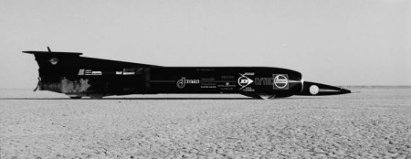

# Informações do Laboratório de Dinâmica dos Fluidos - FGA

Este documento deve orientar a elaboração e execução de um experimento que visa atender parte dos requerimentos da disciplina de Dinâmica dos Fluidos. O objetivo do relatório é realizar a aplicação de instrumentos básicos de gestão de projetos para a elaboração, planejamento, preparação e execução de um experimento de Mecânica dos Fluidos. 

Esse documento não pretende esgotar todas as questões relativas à atividade. Complementações podem ser feitas além do requerimento mínimo de conteúdo. Mas os itens mínimos devem ser preenchidos. 

Este trabalho deverá ser feito em grupos de até três pessoas. Grupos com número de integrantes diferente de três poderão ser formados a critério única e exclusivamente do professor. 

Objetivos do laboratório: 

1. Identificar problemas de engenharia cujas soluções envolvam conhecimentos de dinâmica dos fluidos;  

2. Entender a terminologia e fundamentos básicos de um problema laboratorial, avaliando a viabilidade de sua solução, por meio do estabelecimento de um projeto no contexto dos recursos disponíveis na FGA;  

3. Estabelecer, especificar e executar um projeto de engenharia, visando a solução de um problema;  

4. Desenvolver a habilidade de geração de novas soluções para problemas práticos de dinâmica dos fluidos, por meio da análise, síntese e otimização de sistemas; 

5. Desenvolver a capacidade de comunicação técnica escrita e oral; 

6. Desenvolver a capacidade de trabalho em equipe; 

Abaixo segue como colocar equações e imagens:

Exemplo para anexar uma imagem (A imagem deve ser enviada para a pasta do grupo via *upload*):

Para escrever as equações usando o formato do LateX use [este link](https://www.codecogs.com/latex/eqneditor.php). A equação deverá ser gerada no site, salva em formato .gif e enviada para o repositório para ser anexada como imagem, conforme exemplo abaixo:

O laboratório consistirá de quatro etapas, que valerão 25% da nota do laboratório cada. Estas etapas são:

1. Início: 

A primeira etapa deverá conter os objetivos do experimento escolhido. Um problema prático, dentro dos temas propostos a seguir, deve ser proposto para que possa ser resolvido experimentalmente utilizando os conhecimentos do curso de dinâmica dos fluidos. 

Inicialmente, cada grupo deverá escolher um tema para o experimento. Temas poderão ser repetidos entre grupos, mas é vedada a repetição de experimentos. Os temas disponíveis são: 

-	Linhas de emissão de um escoamento fluido
-	Vorticidade
-	Efeito Magnus
-	Efeito de Bernoulli
- Tubo Venturi
-	Placa de Orifício
-	Perda de Carga
-	Controle de Camada Limite
-	Turbulência em Fluidos
-	Experimentos em túnel de vento

Em seguida, os grupos deverão: 
- Refinar o entendimento do experimento com conhecimentos de dinâmica dos fluidos, seu escopo e abrangência; 
- Refinar o problema a ser resolvido, a fim de identificar seus principais requisitos (ou objetivos) funcionais e não funcionais; 
- Analisar a viabilidade a partir de alguns requisitos básicos, como tempo (prazo de 1 semestre letivo), desafios técnicos, etc. 

O relatório desta etapa deverá ser feito no repositório de cada grupo **até o dia 31/08/2019**, contendo os seguintes tópicos: 
- Integrantes do grupo; 
- Tema escolhido; 
- Objetivo do experimento – O que será medido ou determinado no experimento; 
- Requisitos de solução - Avaliação das possíveis soluções para cumprir os objetivos do experimento; 
- Escopo do experimento – Estabelecimento de tarefas mínimas para cumprir os objetivos do experimento; 
- Avaliação de viabilidade do experimento; 

### 2.	Planejamento e Preparação:

Nesta etapa, o experimento deverá ser planejado. A teoria envolvida deverá ser apresentada e os procedimentos experimentais deverão ser planejados nesta etapa.

O relatório desta etapa deverá ser feito no arquivo destinado a cada grupo neste repositório até o **dia 29/04/2019**, contendo os seguintes tópicos:

- Identificação do grupo;
- Teoria do experimento;
- Procedimentos experimentais, onde as seguintes informações deverão ser colocadas:
    - Estimativa do tempo necessário para a montagem e execução do procedimento;
    - Membro do grupo responsável pelo procedimento de montagem e execução;
    - Cronograma estimado para a montagem e realização do experimento completo;
- Determinação dos dados a serem medidos e/ou calculados;
- Resultados esperados;

### 3.	Execução:

Nesta etapa, o experimento deverá ser montado e executado. A montagem e execução do experimento deverão ser apresentados nesta etapa.

O relatório desta etapa deverá ser feito no arquivo destinado a cada grupo neste repositório até o **dia 15/06/2019**, contendo os seguintes tópicos:

- Integrantes do grupo;
- Divisão de tarefas, conforme descrito na etapa 2. Se houver mudança em relação à etapa 2, uma justificativa deverá ser apresentada;
- Descrição dos procedimentos realizados, onde deverão ser apresentados:
  - Fotos do experimento montado;
  - Descrição de cada procedimento executado e justificativa, se houver diferença com a etapa 2;
  - Dados medidos;
  
  
OBSERVAÇÕES: 
-	Os grupos que desejarem usar o laboratório de termofluidos para a montagem e execução do experimento poderão fazê-lo nos horários de quarta-feira a partir de **03/04/2019**. 
-	O grupo deverá avisar o professor com antecedência, e poderá ir ao laboratório o número de vezes necessária para a completa execução do experimento;
-	Será permitido um máximo de quatro grupos por dia;

### 4.	Análise e conclusão:

Nesta etapa, os dados medidos na etapa 3 deverão ser analisados e o experimento deverá ser concluído. A análise de dados deverá ser apresentada nesta etapa.

O relatório desta etapa deverá ser feito no arquivo destinado a cada grupo neste repositório até o **dia 29/06/2019**, contendo os seguintes tópicos:

-	Integrantes do grupo;
-	Apresentação dos dados medidos no experimento com seu respectivo erro experimental;
-	Apresentação de gráficos e sua respectiva análise;
-	Comparação dos resultados com a teoria envolvida;
-	Conclusões do experimento;
